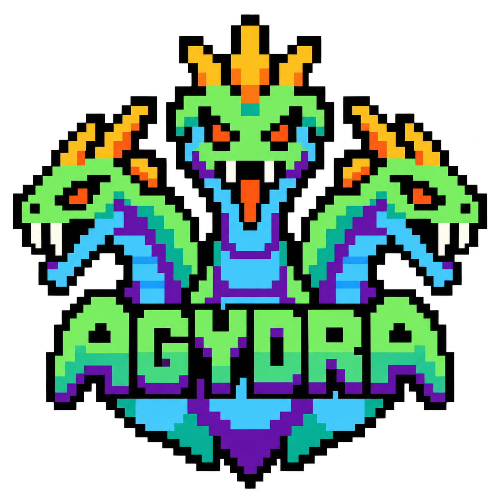

# agydra

<p align="center">
  
</p>

<p align="center">
  <a href="LICENSE"></a>
  <a href="pyproject.toml"></a>
  <a href="pyproject.toml"></a>
  
  <a href="https://www.DragonJAR.org"></a>
  <a href="README.md"></a>
</p>

> **Una sola instalación, múltiples cuentas de IA totalmente aisladas y cero cuellos de botella.** `agydra` es un gestor multi-perfil y despachador de cargas para **Google Antigravity (`agy`)** y **OpenAI Codex (`codex`)**. Concebido para desbloquear el inmenso potencial del pooling multi-cuenta y los planes familiares —donde cada cuenta miembro dispone de cuotas de tokens y límites de tasa (rate limits) 100% independientes—, `agydra` elimina la restricción de un único almacén central mediante entornos ligeros y aislados por perfil. Tus credenciales reales jamás se alteran y los binarios oficiales nunca se interceptan ni parchean. Desarrollado estrictamente con la librería estándar de Python (**Python ≥ 3.9, cero dependencias de terceros en runtime**): un núcleo limpio y DRY con adaptadores nativos para macOS, Linux y Windows.

---

## 💡 ¿Por qué Agydra?

### 🎯 La Génesis: Desbloqueando la Ventaja del Plan Familiar de Google

A diferencia de prácticamente toda la industria de IA (donde las suscripciones son estrictamente individuales, cobradas por usuario y sin opciones compartidas), **Google ofrece una ventaja disruptiva a través de los Grupos Familiares en Google One AI Premium / Google AI Pro**. Una sola suscripción familiar permite invitar hasta a 5 miembros adicionales (6 cuentas familiares en total).

Lo fundamental: **cada una de las cuentas del grupo familiar recibe sus propios límites de tokens y ventanas de tasa (rate limits) de 5 horas de forma 100% individual e independiente**.

Para desarrolladores, investigadores y flujos con agentes autónomos, esto representa una oportunidad extraordinaria y 100% legítima: **multiplicar la capacidad de cómputo de IA de 5x a 6x bajo una única suscripción y a una fracción del costo habitual**.

### 🚧 El Bloqueo: La Arquitectura Monolítica de Almacén Único de `agy`

A pesar de la generosa política de cuotas de Google, el cliente oficial Antigravity (`agy`) fue diseñado con una limitación estructural crítica: deriva su configuración y tokens de sesión exclusivamente de una única ruta fija en el directorio del usuario: `~/.gemini`.

Esta restricción generaba un grave cuello de botella operativo:
- **Cambio destructivo de cuentas:** Para alternar a otra cuenta del grupo familiar, el usuario debía ejecutar el flujo OAuth en el navegador, sobreescribiendo las credenciales anteriores y perdiendo el contexto activo de sesión.
- **Cero concurrencia:** Era imposible ejecutar pruebas, builds o subagentes autónomos en paralelo entre distintas cuentas, ya que todas las llamadas colisionaban en la misma carpeta física `~/.gemini` y en los mismos registros de keychain.
- **Capacidad desperdiciada:** Al alcanzar el límite de 5 horas en una cuenta durante una sesión intensa de programación, el trabajo se detenía por completo, a pesar de tener las demás cuentas del plan familiar ociosas y con el 100% de su cuota disponible.

### 🚀 La Solución: Pooling Multi-Cuenta Legítimo con Agydra

`agydra` fue concebida precisamente para derribar esta barrera y convertir un conjunto de cuentas familiares de Google en un pool unificado de alta disponibilidad para desarrollo con IA:

```
agy                 → sesión genérica, utiliza el ~/.gemini real (intacto)
agydra -p fam-dev   → mismo binario agy, pero HOME apunta al overlay aislado del perfil
```

- **Pooling Multi-Cuenta 100% Conforme a Políticas:** Cero ingeniería inversa, sin scraping y sin hacks de tokens compartidos. Cada perfil se autentica de forma independiente vía OAuth estándar mediante el CLI oficial `agy` de Google.
- **Cero Mezcla de Credenciales:** Cada perfil mantiene sus tokens privados en un almacén aislado (`<store>/profiles/<nombre>/data`), completamente desacoplado de los archivos del sistema host.
- **Ejecución Paralela Multi-Cuenta:** Ejecuta tareas en simultáneo entre distintas cuentas sin ningún conflicto de tokens ni sobreescrituras.
- **Bloqueos Consultivos a Nivel de Kernel:** Las sesiones se protegen mediante locks de archivo del SO (`fcntl.flock` / `msvcrt.locking`) que se liberan automáticamente incluso ante fallos abruptos o señales SIGKILL.
- **Despacho y Rotación Automática (`-r`):** Distribuye comandos al perfil libre y menos recientemente usado de forma automática, esquivando los límites de tasa de cuentas individuales.
- **Monitoreo Centralizado de Cuotas (`usage`):** Supervisa cuotas en vivo, ventanas de 5 horas y cuentas regresivas de reinicio de todo el pool familiar en una sola pantalla.

---

## ⚡ Inicio Rápido

### Requisitos Previos

| Requisito | Detalle |
|---|---|
| **Python ≥ 3.9** | Solo librería estándar — cero dependencias de terceros en runtime. |
| **CLI `agy`** *(opcional)* | CLI oficial de Google Antigravity. Requerido en el `PATH` (o vía `-b` / config) para perfiles de `agy`. |
| **CLI `codex`** *(opcional)* | CLI oficial de OpenAI Codex. Requerido en el `PATH` (o vía `-b` / `AGYDRA_CODEX_BIN`) para perfiles de `codex`. |
| **bwrap** *(opcional)* | Solo Linux: sandbox bubblewrap para enmascarar sockets DBus/keyring (`use_linux_sandbox`). |

### 1. Instalación

**Recomendado (Instalación en un solo comando desde el clon):**

```sh
# Clona el repo, crea un venv local, instala el script de consola y coloca un shim en ~/.local/bin
python3 agydra.py
```

*O mediante pip/pipx:*

```sh
pip install .        # o: pipx install .
```

Verifica tu entorno de inmediato:

```sh
agydra doctor
```

### 2. Configuración Inicial (En menos de 60 segundos)

**Google Antigravity (`agy` — motor por defecto):**

```sh
# 1. Crea tu perfil aislado
agydra create trabajo -d "Cuenta corporativa de Google"

# 2. Completa el flujo OAuth una sola vez (los tokens se guardan en el almacén de 'trabajo')
agydra login trabajo

# 3. Lanza agy con tu nuevo perfil
agydra -p trabajo "Explica la computación cuántica en tres frases"
```

**OpenAI Codex (motor `codex`):**

```sh
# 1. Crea tu perfil aislado para Codex
agydra create codex-trabajo -e codex -d "Cuenta corporativa de OpenAI"

# 2. Completa el inicio de sesión de Codex una sola vez (tokens en el almacén aislado)
agydra login codex-trabajo

# 3. Lanza codex con tu nuevo perfil (sin demonio por defecto, sin caídas de socket)
agydra -p codex-trabajo "Revisa el último diff de git en busca de vulnerabilidades"
```

### 3. ⭐ Caso de Uso Estelar: Creación y Orquestación de un Pool de Plan Familiar

A continuación se presenta el flujo completo de principio a fin para configurar y orquestar un pool multi-cuenta aprovechando al máximo un Plan Familiar de Google (Google One AI Premium / Google AI Pro):

#### Paso 1: Crea los perfiles del grupo familiar
Configura almacenes aislados para las cuentas de tu grupo familiar (por ejemplo, especializadas en desarrollo, investigación o agentes autónomos):
```sh
agydra create fam-principal     -d "Plan Familiar - Cuenta Principal"
agydra create fam-desarrollo    -d "Plan Familiar - Código y Refactorización"
agydra create fam-agentes       -d "Plan Familiar - Agentes Autónomos"
agydra create fam-investigacion -d "Plan Familiar - Investigación Profunda"
```

#### Paso 2: Autentica cada cuenta una sola vez
Inicia sesión en cada perfil mediante el flujo OAuth oficial. El navegador abrirá la página oficial de Google y guardará las credenciales exclusivamente en el almacén aislado de cada perfil:
```sh
agydra login fam-principal
agydra login fam-desarrollo
agydra login fam-agentes
agydra login fam-investigacion
```
*(Tip: Ejecuta `agydra list` para confirmar que cada perfil muestre su correo electrónico correspondiente y el estado `authenticated`).*

#### Paso 3: Despacho automático y rotación con `agydra -r`
Olvídate de gestionar cuotas y límites manualmente. Con `-r` (`--random`), `agydra` asigna cada comando al perfil autenticado, desocupado y menos recientemente usado del pool:
```sh
# Terminal 1: Selecciona automáticamente fam-desarrollo
agydra -r "Refactoriza el middleware de autenticación para usar JWT"

# Terminal 2 (simultáneo): fam-desarrollo está ocupado; agydra despacha automáticamente a fam-agentes
agydra -r "Genera suite de pruebas de integración para la API"

# ¿Alcanzaste el límite de 5 horas en una cuenta? Lanza con -r:
agydra -r "Continúa la auditoría del repositorio"  # Asigna al instante la siguiente cuenta libre
```

#### Paso 4: Monitorea todo el pool con `agydra usage`
Supervisa en tiempo real las cuotas de tokens, planes de suscripción y temporizadores de reinicio de todas tus cuentas desde una sola pantalla:
```sh
agydra usage
```
```text
agydra usage                                     9 perfiles · dom 27 sep · 23:18

■ ANTIGRAVITY               GEMINI                  CLAUDE + GPT
 #   PERFIL    CUENTA        DISPONIBLE SEM · 5H     DISPONIBLE SEM · 5H
 1   alpha     averylongte…  ██░░░ 30    30 · 100    █░░░░ 26    26 · 100
 2   beta      lead.dev@gm…  ██░░░ 48    48 · 100    ██░░░ 47    47 · 100
 3   neta      agent.bot@g…  ████░ 85    85 ·  94    ██░░░ 46    46 · 100
 4   chido     audit.sec@g…  ✗ no elegible           ✗ no elegible
 5   chimba    coder.jr@gm…  ██░░░ 42    42 ·  59    ███░░ 66    66 · 100
 6   parce     team.ops@gm…  ████░ 74    74 ·  97    █░░░░ 18    18 · 100
 7   vacan     data.anal@g…  ████░ 73    73 ·  99    █████ 100  100 · 100

■ OPENAI CODEX
 #   PERFIL    CUENTA        PLAN            ESTADO
 8   codex     averylongte…  ChatGPT Plus    autenticado
 9   codexjar  contacto@dr…  ChatGPT Team    autenticado

▸ USAR AHORA   Gemini → neta 85%   Claude/GPT → vacan 100%   Codex → codex (ChatGPT Plus)
✗ chido: cuenta no elegible para Antigravity. Hay que verificarla.
```

El panel de cuotas es completamente responsivo: adapta y condensa dinámicamente sus columnas según el ancho del terminal (desde correo completo hasta correo truncado, barras de 5 bloques y columnas condensadas) evitando saltos de línea desalineados.

Para un análisis granular de una cuenta cercana a su límite, consulta las barras gráficas y la cuenta regresiva exacta de reinicio:
```sh
agydra usage vacan
```
```text
profile   : vacan
email     : deep.res@gmail.com

Gemini Models
  Weekly Limit Remaining      [█████████░]  73.0%  reset in 4d 18h
  Five Hour Limit Remaining   [██████████]  99.0%  reset in 3h 42m

Claude and GPT models
  Weekly Limit Remaining      [██████████] 100.0%  reset in 5d 02h
```

---

## 🚀 Flujos de Trabajo Principales

### 1. Aislamiento por Proyecto sin Fricción (`agydra use`)
Olvídate de pasar `-p` en cada comando. Fija un perfil a un repositorio o carpeta una sola vez:

```sh
cd ~/proyectos/pasarela-pagos
agydra use cliente-acme

# Todos los comandos agydra dentro de este árbol usarán automáticamente 'cliente-acme'
agydra "Resume los commits recientes"
agydra status
```

### 2. Pool de Cuentas y Ejecución Concurrente (`agydra -r`)
Al orquestar agentes automáticos, tareas en lote o rotar entre un grupo de cuentas de un Plan Familiar de Google entre varias terminales, usa `-r` (`--random`) para seleccionar automáticamente el perfil autenticado, desocupado y menos recientemente usado:

```sh
# Terminal 1: Toma el perfil 'alfa'
agydra -r "Ejecutar pruebas de integración"

# Terminal 2: Toma automáticamente el perfil 'beta' (salta el ocupado 'alfa')
agydra -r "Revisar hallazgos de seguridad"
```

### 3. Inspección de Cuotas en Tiempo Real (`agydra usage`)
Supervisa cuotas de modelos y límites de tasa en todas tus cuentas sin necesidad de abrir sesiones interactivas:

```sh
# Vista global resumida de todas las cuentas
agydra usage

# Desglose detallado para un perfil específico con temporizadores de reinicio
agydra usage trabajo
```

*Nota:* `agydra usage` es de solo lectura y puede ejecutarse de forma segura junto a sesiones activas.

### 4. Compartir Configuración sin Fugas de Secretos (`agydra share-config`)
Distribuye herramientas personalizadas y definiciones MCP entre cuentas sin transferir secretos OAuth:

```sh
# Copia únicamente settings.json y mcp.json; las credenciales permanecen estrictamente privadas
agydra share-config trabajo personal pruebas
```

### 5. Verificación en Seco (`agydra -n`)
Inspecciona variables de entorno, redirecciones del sistema de archivos y argumentos sin ejecutar ninguna acción:

```sh
agydra -np trabajo "¿Cuál es mi entorno actual?"
```

### 6. Soporte Multi-Motor: Google Antigravity + OpenAI Codex

`agydra` incorpora una arquitectura de controladores basada en el patrón Strategy que soporta tanto **Google Antigravity (`agy`)** como la CLI de **OpenAI Codex (`codex`)**:

```sh
# Crea perfiles aislados para Codex (-e codex)
agydra create openai-trabajo -e codex -d "Cuenta de empresa de OpenAI"
agydra create openai-personal -e codex -d "Cuenta personal ChatGPT Plus"

# Autentica cada perfil de Codex una sola vez (ejecuta `codex login` aislado)
agydra login openai-trabajo
agydra login openai-personal

# Lanza codex con un perfil específico
agydra -p openai-trabajo "Refactoriza el middleware de autenticación a Python 3.12"

# Rota automáticamente entre cuentas de Codex autenticadas y desocupadas
agydra -e codex -r "Revisión completa de la suite de pruebas"

# Fija un directorio a un perfil de Codex
cd ~/proyectos/backend-rust
agydra use openai-trabajo
agydra "Optimiza la gestión de memoria en el parser"
```

- **Paso Transparente de Flags y Subcomandos (Paridad Total de CLI):** Cualquier flag, subflag o subcomando se entrega íntegramente a la CLI de Codex junto con `--no-daemon`. Comandos como `agydra -p codex --yolo`, `agydra --force -r -e codex --dangerously-bypass-approvals-and-sandbox` o `agydra -p codex exec --help` se ejecutan sin fricción bajo el perfil aislado correspondiente.
- **Ejecución sin Demonio por Defecto (Cero Fallos de Socket y Fuga de Locks):** Por defecto, OpenAI Codex intenta arrancar un demonio en segundo plano (`app-server-daemon`) sobre un socket UNIX local. En entornos POSIX/macOS, las rutas de sockets tienen un límite estricto (`SUN_LEN` = 104 bytes). Al anidarse dentro del almacén del perfil, Codex falla con el error `path must be shorter than SUN_LEN`. Además, los demonios en segundo plano heredan los descriptores de archivo, dejando los locks del perfil permanentemente ocupados tras la salida del CLI. `agydra` elimina ambos problemas de forma automática y transparente:
  1. Inyecta `--no-daemon` por defecto en todas las invocaciones de Codex.
  2. Genera y configura `config.toml` con `[features]\ndaemon_auto_start = false` en el almacén del perfil.
  3. Garantiza una ejecución síncrona, limpia, con liberación inmediata de locks por el kernel y compatibilidad total con contenedores.
- **Almacén Aislado mediante `$CODEX_HOME`:** El CLI oficial de Codex deriva su estado de `$CODEX_HOME`. `agydra` aísla `$CODEX_HOME` directamente en `<store>/overlays/<perfil>/.codex` (enlazado simbólicamente a `<store>/profiles/<perfil>/data`), protegiendo totalmente tu directorio de usuario (`~/.codex`) contra sobreescrituras.
- **Cero Fricción en el Keychain e Inspección Nativa de Planes:** Codex gestiona tokens en ficheros locales (`auth.json`). `agydra` inspecciona directamente los claims JWT `id_token` (`email` y plan de suscripción: `ChatGPT Plus`, `ChatGPT Team`, `ChatGPT Pro`, o `OpenAI API Key`) y omite las operaciones de Keychain en macOS para perfiles de Codex.
- **Compartición Segura de Configuración (`share-config`):** La sincronización entre cuentas de Codex permite propagar personalizaciones en `config.toml` garantizando que los tokens y credenciales de `auth.json` jamás sean expuestos ni copiados.

### 7. Soporte Multi-idioma / Internacionalización (`agydra lang` / `--lang`)

`agydra` incluye soporte nativo de internacionalización en español (`es`) e inglés (`en`). Al configurar tu preferencia de idioma, esta queda automáticamente guardada y recordada en `agydra.json` para todas las ejecuciones futuras sin necesidad de volver a indicarla:

```sh
# Establece el idioma en español de forma persistente (guardado en configuración)
agydra lang es
# O pásalo mediante flag global (también persiste la preferencia)
agydra --lang es list

# Consulta el idioma actualmente activo y su origen de resolución
agydra lang

# Cambia de nuevo a inglés
agydra lang en
```

También puedes sobreescribir el idioma temporalmente por sesión sin alterar el archivo de configuración mediante la variable de entorno `AGYDRA_LANG`:

```sh
AGYDRA_LANG=es agydra status
```

---

## 🧭 Referencia de Comandos y Parámetros

### Subcomandos y Alias

Cualquier subcomando de gestión acepta también la sintaxis `--NOMBRE` o `-NOMBRE` (por ejemplo `agydra --list` == `agydra list`).

#### Perfiles y Autenticación
| Comando | Alias | Descripción |
|---|---|---|
| `agydra list` | `ls`, `l` | Muestra tabla de perfiles: número, email, marca default, estado de auth, ocupado, motor, último uso. |
| `agydra create NOMBRE [-d DESC] [-e MOTOR]` | `c` | Crea el almacén de un perfil aislado (`-e` define el motor: `agy` [por defecto] o `codex`). |
| `agydra login [NOMBRE\|#] [-f] [-n]` | `in` | Corre el flujo de login aislado a ese perfil (`agy` OAuth o `codex login`; `-f` fuerza re-login; `-n` dry-run). |
| `agydra import NOMBRE\|# [-s DIR]` | `imp` | **Copia** (nunca mueve) un almacén existente a un perfil (`-s` sobreescribe el directorio origen). |
| `agydra rename A B` | `mv` | Renombra un perfil y actualiza referencias por defecto (rechaza perfiles ocupados). |
| `agydra delete NOMBRE\|# [-f] [--no-backup]` | `rm` | Crea un respaldo de seguridad ZIP en `backups/` y elimina el perfil (rechaza ocupados). |

#### Enrutamiento y Fijación de Directorios
| Comando | Alias | Descripción |
|---|---|---|
| `agydra default [NOMBRE\|#]` | `d` | Consulta o establece el perfil por defecto global. |
| `agydra use [NOMBRE\|#]` | `u` | Escribe un marcador `.agydra` fijando el perfil al directorio actual. |
| `agydra status [-n]` | `st` | Muestra perfil activo, motor, razón de resolución, binario, email, estado de auth y lock. |

#### Cuotas y Diagnósticos
| Comando | Alias | Descripción |
|---|---|---|
| `agydra usage [NOMBRE\|#]` | `us` | Inspecciona cuotas de modelos en vivo y estados de límite de tasa entre cuentas (`agy`). |
| `agydra share-config ORIGEN DESTINO...` | `share` | Copia de forma segura `settings.json` y `mcp.json` desde `ORIGEN` (nunca credenciales). |
| `agydra doctor [--fix] [-f]` | `doc` | Suite de diagnósticos. `--fix` repara automáticamente enlaces rotos, locks huérfanos y slots obsoletos. |

#### Sistema y Configuración
| Comando | Alias | Descripción |
|---|---|---|
| `agydra setup [-n]` | `install` | Instalador idempotente: valida venv, instala script de consola y configura shim en PATH. |
| `agydra lang [CÓDIGO]` | `language`, `idioma`, `locale` | Consulta o establece de forma persistente el idioma del CLI (`en`, `es`). |
| `agydra version` | `-v`, `--version` | Muestra la versión de agydra, versión de Python y sistema operativo. |
| `agydra help [COMANDO]` | `-h`, `--help` | Muestra información de ayuda para agydra o un subcomando específico. |

### Parámetros del Lanzador

Los flags del lanzador deben especificarse **antes** de los argumentos destinados al motor:

| Flag Corto | Flag Largo | Descripción |
|:---:|---|---|
| `-p NOMBRE\|#` | `--profile` | Perfil objetivo por nombre o número 1-based (de `agydra list`). |
| `-r` | `--random` | Elige automáticamente el perfil libre, autenticado y menos usado (filtra por `-e` si se provee). |
| `-e MOTOR` | `--engine` | Motor CLI objetivo (`agy` [por defecto] o `codex`). Filtra candidatos para `-r`. |
| `--lang CÓDIGO` | — | Establece y persiste el idioma activo del CLI (`en`, `es`). |
| `-n` | `--dry-run` | Imprime el plan de lanzamiento, rutas y entorno sin ejecutar el motor. |
| `-b RUTA` | `--binary` | Sobreescribe la ruta del ejecutable del motor (`agy` o `codex`) para esta llamada. |
| `-f` | `--force` | Omite la adquisición del lock de sesión; permite ejecuciones paralelas o de emergencia sobre perfiles ocupados. |

### 🔀 Combinaciones Comunes de Parámetros

Los flags cortos se pueden agrupar según las convenciones estándar POSIX (`-nr` == `-n -r`):

| Combinación | Equivalencias | Propósito |
|---|---|---|
| `agydra -p trabajo "prompt"` | `--profile=trabajo`, `-ptrabajo` | Lanza `agy` con un perfil explícito. |
| `agydra -p codex-trabajo "prompt"` | `--profile=codex-trabajo` | Lanza `codex` con un perfil aislado (sin demonio por defecto). |
| `agydra -r "prompt"` | `--random` | Toma automáticamente una cuenta libre y autenticada de `agy` del pool. |
| `agydra -e codex -r "prompt"` | `--engine=codex --random` | Toma automáticamente una cuenta libre y autenticada de `codex` del pool. |
| `agydra -rf "prompt"` | `-r -f`, `--random --force` | Elige perfil libre; si todos están ocupados o solo hay 1 perfil, fuerza el lanzamiento. |
| `agydra -np trabajo` | `-n -p trabajo`, `--dry-run -p trabajo` | Inspecciona el plan de lanzamiento (rutas, entorno, binario) sin ejecutar nada. |
| `agydra -nr` | `-n -r`, `--dry-run --random` | Visualiza qué perfil libre sería seleccionado sin ejecutar `agy`. |
| `agydra -fp trabajo` | `-f -p trabajo`, `--force -p trabajo` | Omite el lock de sesión para una tarea paralela urgente o tras una caída previa. |
| `agydra -b /ruta/agy -p trabajo` | `--binary /ruta/agy -p trabajo` | Prueba un binario experimental del motor con credenciales aisladas. |
| `agydra doctor --fix -f` | `agydra doc --fix --force` | Ejecuta autoreparación de perfiles colgados, locks y enlaces huérfanos sin confirmación interactiva. |
| `agydra delete antiguo -f` | `agydra rm antiguo --force` | Borrado no interactivo (genera respaldo ZIP primero; sigue rechazando perfiles ocupados). |

### Cascada de Resolución de Perfiles

Al lanzar sin `-p`, `agydra` resuelve el perfil activo de forma determinista (la primera coincidencia gana):

```
1. Flag --profile / -p
   └── 2. Variable de entorno AGYDRA_PROFILE
       └── 3. Archivo marcador .agydra (directorio ancestro más cercano al CWD; anula -r)
           └── 4. default_profile configurado en agydra.json
               └── 5. Primer perfil en orden alfabético
```

**Códigos de Salida:** `0` Éxito · `1` Error general o fallo de diagnóstico · `2` Conflicto de flags (`-p` + `-r`) · `126` Binario no ejecutable · `127` Binario no encontrado · `130` Interrumpido con Ctrl-C.

---

## 🛡️ Arquitectura e Invariantes

```
Home del Host (~/)
├── .gitconfig, .ssh, .bashrc (compartidos de forma nativa vía enlaces/junctions)
├── ~/.gemini (datos genéricos de Google Antigravity, INTACTOS)
└── ~/.codex  (datos genéricos de OpenAI Codex, INTACTOS)

Almacén Agydra (<store root>/)
├── profiles/
│   ├── trabajo/data/     <── Almacenamiento real para agy (~/.gemini layout)
│   └── codex-dev/data/   <── Almacenamiento real para codex (~/.codex layout)
└── overlays/
    ├── trabajo/          <── HOME inyectado durante la ejecución de agy
    │   ├── .gemini       ───> symlink hacia profiles/trabajo/data
    │   └── (symlinks hacia herramientas del host: .gitconfig, .ssh, ...)
    └── codex-dev/        <── CODEX_HOME inyectado apuntando al overlay
        └── .codex        ───> symlink hacia profiles/codex-dev/data
```

### 1. Mecánica del Home Overlay
- `agydra` crea una estructura aislada en `<store>/overlays/<perfil>`.
- Para `agy`, `<overlay>/.gemini` enlaza directamente a `<store>/profiles/<perfil>/data`.
- Para `codex`, `CODEX_HOME` apunta directamente a `<overlay>/.codex`, que enlaza a `<store>/profiles/<perfil>/data`.
- Las entradas principales de configuración del usuario (`.ssh`, `.gitconfig`, entornos de terminal) se reflejan mediante symlinks (o junctions en Windows), asegurando que las herramientas de desarrollo funcionen con total normalidad.
- Los directorios ancestros de la raíz del almacén (como `~/Library` en macOS) se reflejan como directorios reales para que el almacén mismo permanezca inaccesible desde el overlay.
- Se inyecta `AGYDRA_REAL_HOME` en el proceso hijo, permitiendo que subshells y comandos secundarios ubiquen el home real del sistema.

### 2. Bloqueos Consultivos a Nivel de Kernel
- El control de concurrencia utiliza locks de archivo del SO en `<store>/locks/<perfil>.lock` (`fcntl.flock` en POSIX, `msvcrt.locking` en Windows).
- **Cero bloqueos huérfanos:** El bloqueo está ligado al descriptor de archivo del proceso activo. Si el proceso termina (de forma normal, anormal o por `SIGKILL`), el kernel del sistema operativo libera el lock de inmediato.

### 3. Adaptadores Multiplataforma

| Plataforma | Mecanismo | Detalle |
|---|---|---|
| **macOS** | Puente de Keychain | Enlaza el servicio fijo `antigravity` de `agy` con slots privados por perfil (`agydra.<perfil>`). Intercambia credenciales en el slot activo para la sesión y las restaura al salir. Todas las escrituras validan la identidad contra el email conocido del perfil. Los perfiles de Codex omiten este puente como operación no-op. |
| **Linux** | Sandbox bwrap | Sandboxing opcional con bubblewrap (`use_linux_sandbox=true`) para enmascarar sockets DBus/keyring y forzar aislamiento estricto en disco. Degrada limpiamente con una advertencia si `bwrap` no está instalado. |
| **Windows** | Junctions Nativas | El reflejo de directorios aprovecha junctions NTFS (`mklink /J`) y llamadas estándar `Path.unlink()` sin requerir permisos de Administrador ni Modo Desarrollador. |

### 4. Controladores de Motor con Patrón Strategy y Modo sin Demonio por Defecto
- **Desacoplamiento de Motores:** `AgyEngine` y `CodexEngine` aíslan la detección de binarios, adaptación de argumentos, diseño de rutas de datos y análisis de credenciales de identidad.
- **Ejecución sin Demonio Automática:** El CLI de Codex inicia por defecto un demonio en segundo plano (`app-server-daemon`) mediante sockets UNIX. En almacenes anidados de perfiles, la ruta del socket supera el límite de POSIX/macOS (`SUN_LEN` = 104 bytes), provocando caídas con `path must be shorter than SUN_LEN`. Además, los demonios en segundo plano heredan descriptores de archivo y retienen locks indefinidamente. `agydra` erradica esto automáticamente pasando `--no-daemon` en cada ejecución de Codex y configurando `features.daemon_auto_start = false` en `config.toml`. La ejecución es síncrona, robusta y libera locks de forma instantánea al finalizar.

---

## 🩺 Diagnóstico y Salud (`agydra doctor`)

La suite de diagnósticos ejecuta 10 comprobaciones exhaustivas en una sola pasada:

```sh
agydra doctor
```

```text
agydra doctor — agydra 1.0.0 on darwin
legend: [ok]=pass [!!]=warn [XX]=fail
[ok] agy binary: /usr/local/bin/agy
[ok] store writable: ~/Library/Application Support/agydra
[ok] profiles: 3
  - trabajo: authenticated
  - personal: authenticated
  - pruebas: not-authenticated
[ok] locks: no live sessions
[ok] isolation: verified
[ok] keychain bridge: functional
[ok] profile stores contain agy data layout (schema canary passed)
[ok] store clean (no orphaned artifacts)
[ok] linux sandbox: n/a (not linux)
[ok] install: shim valid at ~/.local/bin/agydra

result: healthy
```

**Reparación Automática:**
```sh
agydra doctor --fix
```
Limpia automáticamente overlays huérfanos, purga locks colgados, elimina slots obsoletos del llavero y reconecta enlaces rotos.

---

## ⚙️ Referencia de Configuración

La configuración global reside en `<store root>/agydra.json`:

| Sistema Operativo | Ubicación por Defecto del Almacén |
|---|---|
| **macOS** | `~/Library/Application Support/agydra` |
| **Linux** | `$XDG_DATA_HOME/agydra` o `~/.local/share/agydra` |
| **Windows** | `%LOCALAPPDATA%\agydra` |

*Sobreescribir con:* `export AGYDRA_HOME=/ruta/personalizada`

```json
{
  "default_profile": "trabajo",
  "settings": {
    "use_linux_sandbox": false,
    "copy_settings_on_create": true,
    "windows_redirect_home": false
  },
  "agy_binary": "/usr/local/bin/agy"
}
```

### Variables de Entorno

| Variable | Propósito |
|---|---|
| `AGYDRA_PROFILE` | Establece el perfil activo por defecto (anulado por `-p` y por el marcador `.agydra`). |
| `AGYDRA_LANG` | Establece o sobreescribe el idioma activo del CLI (`en`, `es`). |
| `AGYDRA_HOME` | Directorio personalizado para el almacén de perfiles y overlays. |
| `AGYDRA_AGY_BIN` | Ruta explícita al ejecutable `agy`. |
| `AGYDRA_CODEX_BIN` | Ruta explícita al ejecutable `codex`. |
| `AGYDRA_NO_KEYCHAIN` | Desactiva el intercambio de llavero en macOS (solo archivos de tokens en disco). |
| `NO_COLOR` / `FORCE_COLOR` | Controla los colores ANSI en la terminal. |

---

## 🔧 Estructura del Proyecto y Pruebas

```text
agydra/                     # Estructura plana (cero dependencias de terceros)
├── agydra.py               # Punto de entrada para bootstrap y definición de versión
├── models.py               # Modelos de datos Profile y Config
├── engines.py              # Drivers multi-motor bajo patrón Strategy (AgyEngine, CodexEngine)
├── platforms.py            # Detección de rutas por SO, descubrimiento de binarios y ejecución
├── ui.py                   # Formato ANSI en terminal y estilos de salida
├── i18n.py                 # Catálogo multi-idioma, resolución de locale y persistencia atómica
├── banner.py               # Renderizado del logo en terminal
├── store.py                # CRUD de perfiles, operaciones atómicas y respaldos ZIP
├── locks.py                # Bloqueos de sesión a nivel de kernel (flock / msvcrt)
├── resolver.py             # Cascada determinista de resolución y evaluación de marcadores
├── account.py              # Parseo de tokens OAuth y detección de identidad
├── keychain.py             # Puente de llavero por perfil en macOS
├── isolation.py            # Construcción de home overlays y redirección de entorno
├── runner.py               # Orquestación de lanzamiento: resolver → planear → overlay → ejecutar
├── doctor.py               # Suite de diagnóstico y motor de autoreparación
├── cli.py                  # Analizador de argumentos CLI y despachador de comandos
├── vocab.py                # Vocabulario de comandos y nombres de perfil reservados
├── orphans.py              # Auditoría inversa del almacén y limpiador de huérfanos
├── usage.py                # Inspector de cuotas y parseador de límites de tasa
├── bootstrap.py            # Instalador idempotente de venv y shim en PATH
├── tests/                  # 575 pruebas automáticas unitarias y de integración
├── README.md               # Documentación en inglés
├── README.es.md            # Documentación en español
├── AGENTS.md               # Convenciones de desarrollo e invariantes arquitectónicos
├── LICENSE                 # Licencia MIT
└── pyproject.toml          # Metadatos del empaquetado
```

### Ejecución de Pruebas

La suite de pruebas valida entornos simulados, casos límite y todas las plataformas sin tocar los archivos del sistema:

```sh
python3 -W error::ResourceWarning -m pytest tests/ -q
# 572 passed, 3 skipped (en macOS) en ~45s (0 advertencias)

python3 -m unittest discover -s tests -q
# Ran 575 tests en ~45s - OK
```

---

## ⚠️ Limitaciones

- `agydra` gestiona **perfiles y sesiones**, no la instalación ni las actualizaciones de los binarios `agy` o `codex`.
- El aislamiento depende de las variables de entorno de cada motor (`HOME`/`USERPROFILE` para `agy`, `CODEX_HOME` para `codex`). Si una versión futura de cualquiera de los binarios altera este comportamiento, el canario de esquema de `agydra doctor` lo detecta inmediatamente y te avisa.
- Las ramas específicas de Windows se verifican en Windows nativo; en sistemas Unix se validan mediante la suite de pruebas unitarias aisladas.

---

## 🤝 Contribuir

¡Agradecemos las contribuciones de la comunidad! Por favor respeta nuestros invariantes centrales:
1. **Cero dependencias de terceros en runtime:** Usa estrictamente la librería estándar de Python (`sys`, `os`, `pathlib`, `fcntl`, `tempfile`, etc.).
2. **Paridad multiplataforma:** Los cambios deben ejecutarse de forma idéntica en macOS, Linux y Windows.
3. **Verificación exhaustiva:** Ejecuta los 563 tests antes de abrir un pull request.
4. **Coherencia arquitectónica:** Revisa [AGENTS.md](AGENTS.md) para conocer las directrices completas.

---

## 📄 Licencia

Distribuido bajo la **Licencia MIT**. Consulta [LICENSE](LICENSE) para más detalles.
## 👨‍💻 Autor y Mantenedor

Creado con ❤️ por **Jaime Andrés Restrepo** — [DragonJAR.org](https://www.dragonjar.org)
- **Autor:** Jaime Andrés Restrepo
- **Organización:** [DragonJAR](https://www.dragonjar.org) — Seguridad, Comunidad y Herramientas Libres
- **Contacto:** contacto@dragonjar.org
- **Sitio Web:** [https://www.dragonjar.org](https://www.dragonjar.org)
- **GitHub:** [@DragonJAR](https://github.com/DragonJAR)

---

*Aviso: `agydra` es un proyecto comunitario independiente y no está afiliado, respaldado ni patrocinado por Google. `agy` y Antigravity son marcas registradas de Google LLC. Utiliza tus cuentas y tokens cumpliendo los Términos de Servicio de Google.*
